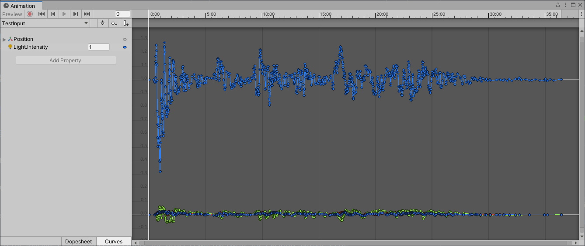

# Im Keyframe Reduction

This tool performs keyframe reduction on an AnimationClip by using polynomial fitting.

[The core script](https://github.com/phi16/ImKeyframeReduction/blob/main/Assets/Im/Script/KeyframeReduction.cs) is licensed under CC0 1.0. It utilizes [MathNet.Numerics](https://numerics.mathdotnet.com/), which is under the MIT license.

## Usage

- Import the [ImKeyframeReduction.unitypackage](https://github.com/phi16/ImKeyframeReduction/raw/main/ImKeyframeReduction.unitypackage).
  - If you have already imported the MathNet.Numerics package, simply copy [the core script](https://github.com/phi16/ImKeyframeReduction/blob/main/Assets/Im/Script/KeyframeReduction.cs) into your project.
- Open the `Window/Im/Keyframe Reduction` window.
- Set the original AnimationClip, and leave the `Output Clip` field empty, then click `Execute`.
  - If the `Output Clip` field is not empty, the process will overwrite the existing `Output Clip`.

## Note

- It is recommended to use Brute Force Mode to obtain accurate results.
  - Looking to fix...

## Example

Input: TestInput.anim (983KB)

Output: TestOutput.anim (232KB), processed with default configuration (threshold = 1e-06, dt = 1/60, non-brute force mode).

